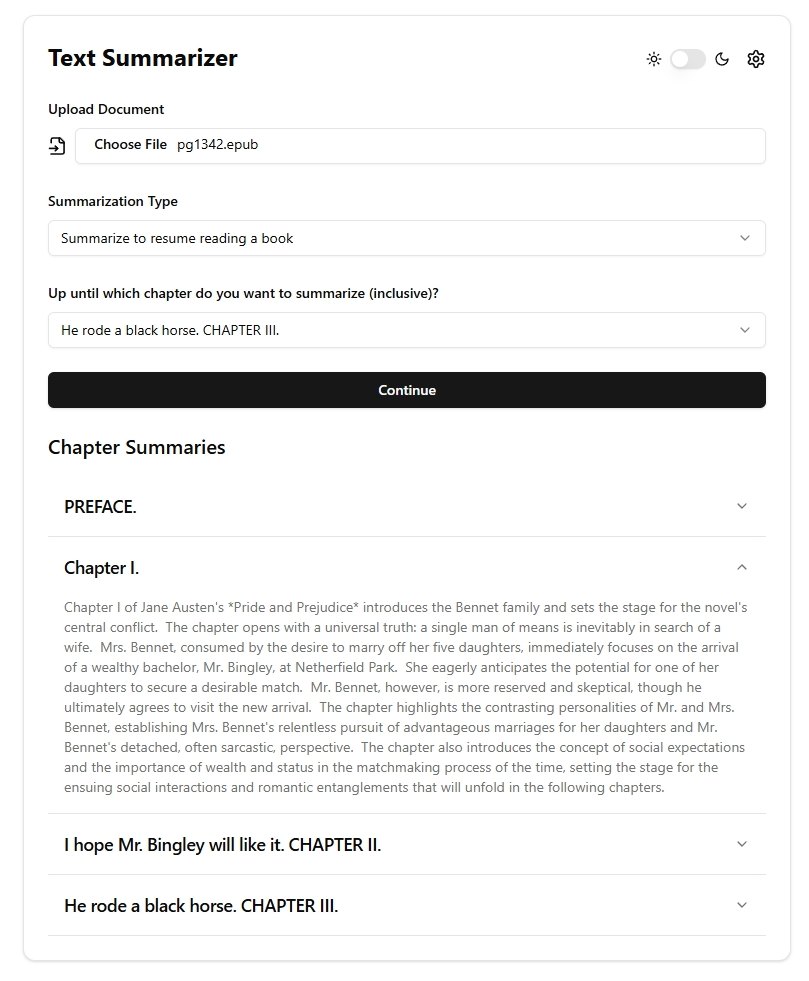

+++
title = "App that helps you pick up reading where you left off"
date = "2025-01-19"
author = "An7"
authorTwitter = ""
tags = []
keywords = []
showFullContent = true
readingTime = true
hideComments = false
+++

Upload an EPUB, choose a chapter until which to summarize, and see summarization
for each previous chapters!

Try at: [https://text-summarizer.hxann.com](https://text-summarizer.hxann.com/)

GitHub: [https://github.com/intagaming/text-summarizer](https://github.com/intagaming/text-summarizer)

_Note: This app mostly doesn't run through my server. It will call LLM providers
directly. You will have to set your own LLM provider and API key in the
settings. And I don't have money so I won't make a SaaS out of this. But my
server does split the chapters up for you though._

